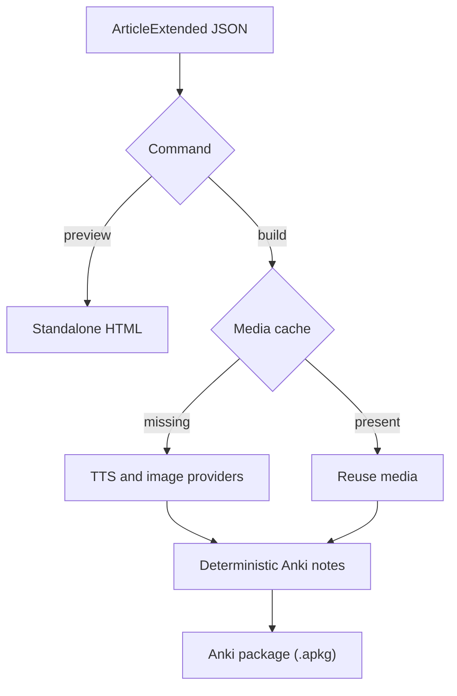

# 📘 Vocab-Learning-Tools

[](https://github.com/adergunov/vocab-learning-tools/actions/workflows/tests.yml)

**Vocab-Learning-Tools** is a set of scripts to help learning vocabulary when learning foreign languages

TODO Describe all the scripts available

Requires Python 3.12 (due to kokoro)

The tool reads an *inbox* file containing raw vocabulary notes (one or more entries separated by `---`),
sends them to an LLM for normalization, and then appends cleanly formatted
articles to topic-specific Markdown files (e.g., `Health.md`, `Misc.md`, etc).

It automatically detects duplicates, fuzzy matches, and malformed articles —
providing a detailed summary and conflict report at the end of each run.

Developed as part of a personal vocabulary-building workflow using LLM-generated examples.

---

## ✨ Example workflow

```
$ python scripts/clean_vocab.py --config config/local.yaml
```

Example output:

```
Processing sections: 100%|███████████████████████| 8/8 [00:19<00:00,  2.5s/section]

Processing complete ✅

Total inbox entries: 8
New items added: 6
Conflicts (exact, skipped): 1
Conflicts (fuzzy, added): 1

Breakdown by topic:
  Health: 2
  Misc: 4

Newly added items:
  Health: desmayarse
  Misc: aleatorio
  ...

Conflicts found:
────────────────────────────────────────────
Conflict #1: el acertijo
────────────────────────────────────────────
Existing in: /data/Misc.md (line 1204)
────────────────────────────────────────────
##### **el acierto** ✅
*success; correct decision*
> Fue un **acierto** contratar a ese nuevo empleado. - It was a wise decision to hire that new employee.

────────────────────────────────────────────
Proposed new article:
────────────────────────────────────────────
##### **el acertijo** 🧠
*riddle*
> Los que resuelvan el **acertijo** podrán entrar al templo. - Those who solve the riddle can enter the temple.
────────────────────────────────────────────
Status: SKIPPED (title conflict)
```

---

## ⚙️ Configuration (`config.yaml`)

All paths and LLM settings are defined in a YAML configuration file, for example:

```yaml
files:
  inbox: "inbox.md"
  output_pattern: "data/%topic.md"

vocabulary:
  language: "Spanish"
  topics:
    - "Health"
    - "Travel"
    - "Food"
    - "Misc"

llm:
  default_provider: "gemini"
  prompt_path: "prompts/vocabulary_prompt_template.txt"
  providers:
    gemini:
      options:
        model: "gemini-flash-latest"
        model_params: {}
        rate_limit_per_minute: 10
    ollama:
      options:
        model: "gemma3:4b"
        model_params: {}
        rate_limit_per_minute: 60

processing:
  batch_size: 3
  show_items: true
```

`config/defaults.yaml` is the tracked source of shared settings. It contains the
topics, processing settings, media providers, and all available LLM providers.
Gemini is selected by `llm.default_provider`. Select Ollama for one run with:

```bash
python scripts/clean_vocab.py --config config/local.yaml --llm-provider ollama
```

The shared `llm.prompt_path` is used by every provider unless that provider defines
its own `prompt_path`. For example:

```yaml
llm:
  providers:
    ollama:
      prompt_path: "prompts/vocabulary_prompt_ollama.txt"
      options:
        model: "gemma3:4b"
```

`config/local.yaml` is an ignored overlay containing only settings that differ on
this machine. For example:

```yaml
files:
  inbox: "/path/to/Spanish vocab - Inbox.md"
  output_pattern: "/path/to/Spanish vocab - %topic.md"
```

Nested values from this file are merged over `config/defaults.yaml`; it does not
need to repeat topics, providers, processing, TTS, or image settings.

---

## 🧠 Prompt system

LLM requests are built using a Jinja2 template (`prompts/vocabulary_prompt_template.txt`)
so you can easily adjust style, structure, or instructions without touching code.

Example prompt template:

```jinja2
You are a helpful assistant that formats Spanish vocabulary items.
Each response must be a Markdown article like this:

##### **{{ word }}** 🎯
*{{ translation }}*
> {{ example_sentence }} - {{ translation_en }}
Topic: {{ topic }}
```

---

## 🧩 Features

✅ **Structured vocabulary articles**
✅ **Topic-based output files** (e.g., `Health.md`, `Food.md`)
✅ **Automatic duplicate & fuzzy-match detection**
✅ **Graceful interrupt handling** (`Ctrl+C` safe)
✅ **Readable CLI summaries & conflict reports**
✅ **Failure-safe inbox cleanup: incomplete or failed batches remain retryable**
✅ **Configurable LLM provider and model**
✅ **Validated extended-article JSON and media cache collections**

---

## 🚀 Quick start

1. **Install dependencies**
   ```bash
   pip install -r requirements.txt
   ```

2. **Create your inbox**
   Add rough or unstructured entries to `inbox.md`, separating items with `---`.

3. **Run the script**
   ```bash
   python scripts/clean_vocab.py --config config/local.yaml
   ```

4. **Check your topic files**
   Newly generated articles appear in `data/Health.md`, `data/Misc.md`, etc.

## Anki deck and HTML preview

Validate an extended JSON article and render a standalone HTML preview. This
does not load Kokoro, Stable Diffusion, or Anki, and it displays cached media
when those files already exist:

```bash
python scripts/generate_anki_deck_draft.py preview input.json
```

Generate missing media through the configured providers and build the deck:

```bash
python scripts/generate_anki_deck_draft.py build input.json --config config/local.yaml
```

Relative paths are resolved from the repository root. By default, regenerable
media is cached under `cache/images` and `cache/audio`; HTML and `.apkg` output
is written under `output`. Use `--force-media` to regenerate cached media, or
`--output` to select a different result path.




To run the slow integration test manually:
`PYTHONPATH=. RUN_SLOW_INTEGRATION_TESTS=True pytest -m integration`
