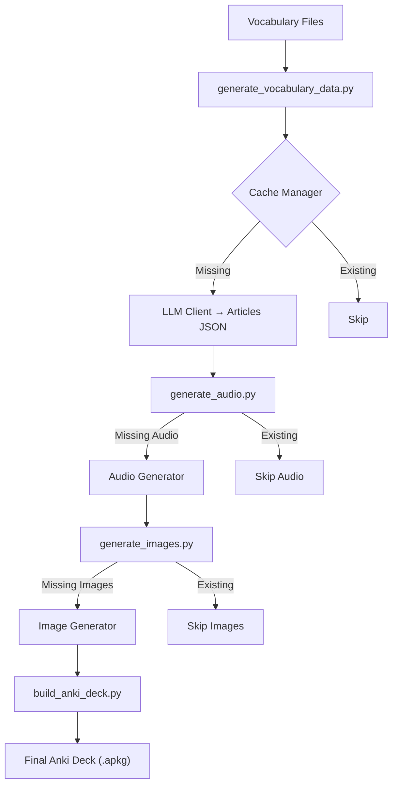

# 📘 Vocab-Learning-Tools

**Vocab-Learning-Tools** is a set of scripts to help learning vocabulary when learning foreign languages

TODO Describe all the scripts available

Requires Python 3.12 (due to kokoro)

The tool reads an *inbox* file containing raw vocabulary notes (one or more entries separated by `---`),
sends them to an LLM for normalization, and then appends cleanly formatted
articles to topic-specific Markdown files (e.g., `Health.md`, `Misc.md`, etc).

It automatically detects duplicates, fuzzy matches, and malformed articles —
providing a detailed summary and conflict report at the end of each run.

Developed as part of a personal vocabulary-building workflow using LLM-generated examples.

---

## ✨ Example workflow

```
$ python scripts/clean_vocab.py --config config/defaults.toml
```

Example output:

```
Processing sections: 100%|███████████████████████| 8/8 [00:19<00:00,  2.5s/section]

Processing complete ✅

Total inbox entries: 8
New items added: 6
Conflicts (exact, skipped): 1
Conflicts (fuzzy, added): 1

Breakdown by topic:
  Health: 2
  Misc: 4

Newly added items:
  Health: desmayarse
  Misc: aleatorio
  ...

Conflicts found:
────────────────────────────────────────────
Conflict #1: el acertijo
────────────────────────────────────────────
Existing in: /data/Misc.md (line 1204)
────────────────────────────────────────────
##### **el acierto** ✅
*success; correct decision*
> Fue un **acierto** contratar a ese nuevo empleado. - It was a wise decision to hire that new employee.

────────────────────────────────────────────
Proposed new article:
────────────────────────────────────────────
##### **el acertijo** 🧠
*riddle*
> Los que resuelvan el **acertijo** podrán entrar al templo. - Those who solve the riddle can enter the temple.
────────────────────────────────────────────
Status: SKIPPED (title conflict)
```

---

## ⚙️ Configuration (`config.toml`)

All paths and LLM settings are defined in a TOML configuration file, for example:

```toml
[files]
inbox = "inbox.md"
output_pattern = "data/%topic.md"

[vocabulary]
topics = ["Health", "Travel", "Food", "Misc"]

[llm]
provider = "openai"
model = "gpt-4o-mini"
prompt_path = "prompts/vocabulary_prompt_template.txt"
max_retries = 2
rate_limit_per_minute = 30

[processing]
batch_size = 3
```

---

## 🧠 Prompt system

LLM requests are built using a Jinja2 template (`prompts/vocabulary_prompt_template.txt`)
so you can easily adjust style, structure, or instructions without touching code.

Example prompt template:

```jinja2
You are a helpful assistant that formats Spanish vocabulary items.
Each response must be a Markdown article like this:

##### **{{ word }}** 🎯
*{{ translation }}*
> {{ example_sentence }} - {{ translation_en }}
Topic: {{ topic }}
```

---

## 🧩 Features

✅ **Structured vocabulary articles**
✅ **Topic-based output files** (e.g., `Health.md`, `Food.md`)
✅ **Automatic duplicate & fuzzy-match detection**
✅ **Graceful interrupt handling** (`Ctrl+C` safe)
✅ **Readable CLI summaries & conflict reports**
✅ **Automatic inbox cleanup & backup**
✅ **Configurable LLM provider and model**

---

## 🚀 Quick start

1. **Install dependencies**
   ```bash
   pip install -r requirements.txt
   ```

2. **Create your inbox**
   Add rough or unstructured entries to `inbox.md`, separating items with `---`.

3. **Run the script**
   ```bash
   python scripts/clean_vocab.py --config config/defaults.toml
   ```

4. **Check your topic files**
   Newly generated articles appear in `data/Health.md`, `data/Misc.md`, etc.




To run the slow integration test manually:
PYTHONPATH=. RUN_SLOW_INTEGRATION_TESTS=True pytest -m integration

