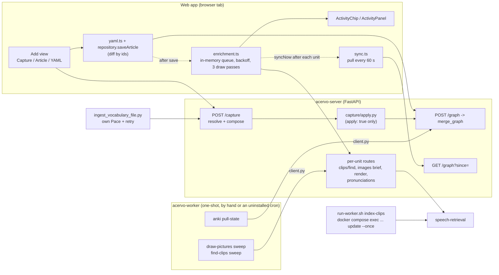
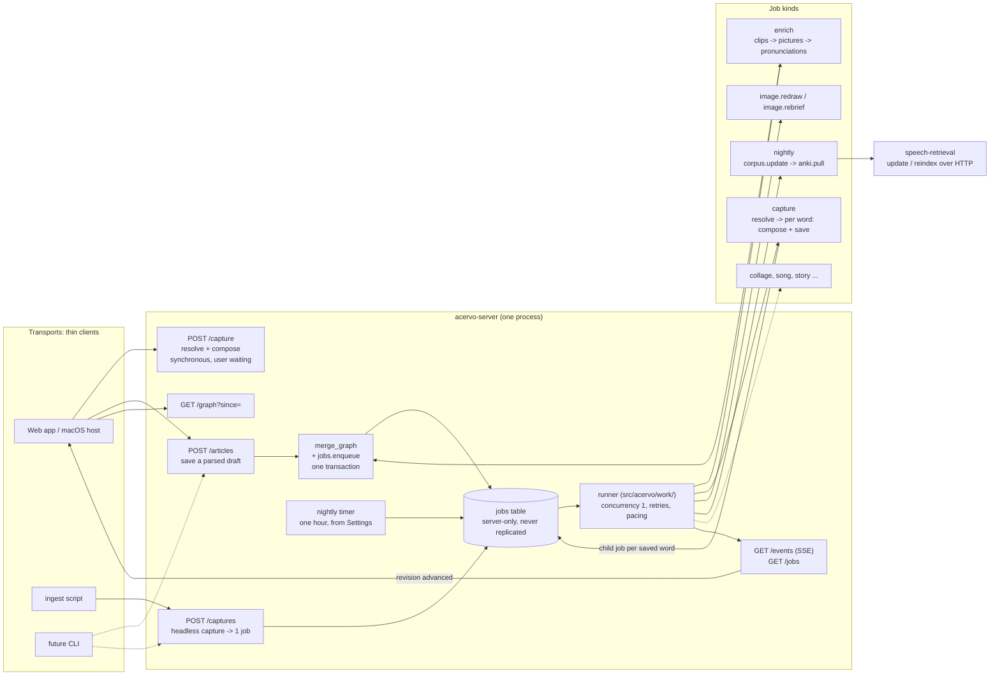
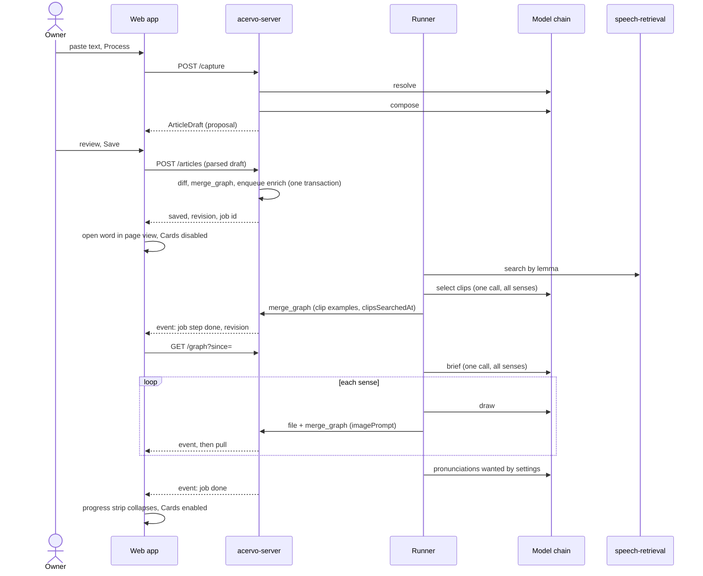

# Processing flow · the server does the work

**Status:** built. This document describes where and when Acervo's processing runs. It did not change
*what* runs: the resolve → compose split, brief → draw, clip selection, alignment and translation,
and every prompt are exactly as they were; they were tuned separately and were out of scope here.

Four things came out differently from the plan below, each because building it showed something the
design had not:

- **A save says what it edited from.** `POST /articles` takes `base`, the revision the device holds
  of every record of that entry. Without it, an edit made on a stale replica would have overwritten
  newer changes silently, and a sense added on another device and not yet pulled would have been
  tombstoned by a document that could not have mentioned it. §4.9 said "the stale-revision refusal"
  and this is what that had to become once the diff moved off the device.
- **A derived id is looked up before it is written.** A clip or picture sent without an id gets its
  derived id, and the save now finds the row already stored under it. The device's diff had the same
  bug; its test fake never checked revisions, so nothing failed.
- **The picture dialog reads its prompt from a route** (`GET /images/prompts/{id}`), because a job
  cannot hand a composed prompt back the way a request could. It shows it always now, rather than
  only after a rewrite.
- **`anki.pull` is declared and refused.** Switching it on is a 409 rather than a nightly failure,
  because pulling Anki's review state still runs from the worker.

This plan supersedes three things:

- the "flows are sweeps, not event consumers" rule in
  [`../acervo-design.md`](../acervo-design.md) §09 and
  [`../acervo-server.md`](../acervo-server.md) "Synchronous and asynchronous";
- the "two engines" decision in [`../acervo-sense-images.md`](../acervo-sense-images.md) §09;
- the shared client queue in [`spoken-clips.md`](spoken-clips.md) §2.11.

[`nas-to-mac-job-queue.md`](nas-to-mac-job-queue.md) stays a sketch. The jobs table introduced here
is the record it asked about; the rest of that plan is not needed.

## Outcome

**The server is the unit that works. The interface is a thin client.**

Every transport goes through the same routes, and every word saved gets the same enrichment,
whoever saved it and whether or not anybody is still looking. That covers the application, the
ingest script and a future command-line client.

Enrichment starts from an event: the write that created the word. Nothing enriches words on a
timer. The only timer left is one nightly run for work that really is time-based: refreshing the
spoken-usage corpus, and later pulling Anki's review state.

When work finishes, the server says so, and the application shows it without a reload.

---

## §1 · How it is wired today



What is wrong with this, in the order it hurts:

1. **The browser runs the enrichment pipeline.**
   - `web/src/enrichment.ts` is a strictly sequential queue held in memory. For each word it runs
     clips, then pronunciations, then a brief, then draws. It waits between attempts (30 s doubling
     to 10 min per kind), makes three draw passes, and calls `syncNow()` after every unit.
   - This is business logic in a place that disappears. Close the tab, or let the tablet background
     it, and the work stops.
2. **Only the application enriches.**
   - The ingest script (`scripts/ingest_vocabulary_file.py`) calls `/capture` with `apply: true`
     and triggers nothing, so its words wait for the sweeps (`App.tsx` says so in a comment).
   - The sweeps (`jobs/images/sweep.py`, `jobs/clips/sweep.py`) are documented as "what a cron line
     calls", but no schedule is installed anywhere in the repository. When they run, and whether
     they run at all, is known to nobody.
3. **Turning a draft into records is written twice.**
   - The server does it in `services/capture/apply.py` for headless capture.
   - The device does it in `yaml.ts` + `repository.saveArticle` for everything else.
   - The ingest script adds its own pacing, retry and a vocabulary preflight on top. A command-line
     client would have to write a third copy.
4. **Retries are layered.**
   - The client backs off.
   - `services/images.py` and `services/clips.py` sleep 15 s *inside a request* before a second
     walk (`REQUEST_ATTEMPTS = 2`).
   - The sweeps back off again.
   - The ingest script has its own ladder.

   None of them knows about the others.
5. **Nobody is told when work finishes.**
   - There is no job record, no status route and no push.
   - The application learns about server-side writes only from the 60 s pull, and only about its
     own work from the in-memory engine.
6. **The interface shows the work inconsistently.**
   - The "Making pictures" chip sits on a crowded canvas and says "pictures" during clip and audio
     work too.
   - A picture has a reserved frame; a clip search is an italic line followed by nothing.
   - On a touch device a new word opens in Cards (`defaultArticleView` in `editorPreferences.ts`),
     so the card set re-flows as each result lands.
7. **The corpus is maintained from a shell.**
   - `run-worker.sh index-clips` is the only way to refresh it.
   - The retrieval service has no HTTP route that starts an update.
   - `addChannel` exists in `web/src/clips.ts`, but nothing in the interface calls it.
   - Disabling a channel stops new downloads, but its clips stay in the index.

---

## §2 · How it will be wired



Adding a word from the application, end to end:



The owner may close the article, or the tab, at any point after Save. Nothing in the sequence above
depends on the application still being open.

---

## §3 · Why the no-queue rule is retired

The rule was written into `acervo-design.md` §09 at Rev. C and copied into
`acervo-sense-images.md` §09 when pictures were built. It was written for an architecture that no
longer exists: Prefect as an *optional* orchestrator, and image generation on an idle-gated MacBook
that could be away for a week. In that world, "derive the work from a query" was a reasonable hedge
against an orchestrator that might not be there.

Its specific arguments, and how each holds up now:

| The argument | Now |
|---|---|
| A lost enqueue loses work. | The job is written in **the same transaction** as the word that needs it. Either both exist or neither does. |
| A job store would be owner-scoped domain data, so it would replicate to every phone. | Not true. `sync_state` and `model_selection` are owner-scoped server state and are never replicated. `jobs` is the third such table. |
| An in-process task dies on every deploy. | Deploys refuse while jobs are open, or cancel them on request (§4, decision 7). Nothing needs to survive a version change. |
| It makes the process that must stay responsive into the orchestrator. | The work is waiting on remote APIs. No database session is held across a model call (already a rule of `repository/`). The load is a thread waiting on sockets. |
| A backgrounded tab freezes its timers. | True, and it is the argument *for* the server, not against it. |
| The worker being down for a week costs only latency. | The worker is now the server. If it is down, so is everything else. |

> **DECISION: Enrichment is event-driven, from a durable job record, and runs in the server.**
>
> **Because** the rule protected against failures this deployment no longer has. Meanwhile it
> forced the application to carry a pipeline, left headless captures unenriched, and pushed the
> rest onto a schedule nobody could see.

Three things the rule got right are kept:

- **Steps are idempotent by derivation.** A job says *which word*. What that word still lacks is
  read from the graph when each step runs: senses without a brief, prompts that are drawable,
  `clipsSearchedAt IS NULL`, recordings the settings want and the word lacks. A job run twice does
  nothing the second time.
- **Derived ids still make writers converge.** `image_prompt_id`, `clip_example_id` and
  `pronunciation_id` are unchanged, so an interactive action and a job working on the same sense
  cannot create two rows.
- **"None" is a successful outcome.** A word with no picture or no clip is complete. A job that
  finds nothing to draw, or no clip worth keeping, has succeeded.

---

## §4 · The decisions

### 1 · What is synchronous and what is a job

> **DECISION: The request waits only while the owner is waiting on its answer to continue.
> Anything that lands on a stored record while the owner may walk away is a job.**

| Synchronous (the owner is waiting) | A job (the result lands on a record) |
|---|---|
| `POST /capture`: resolve + compose for review | enrichment of a saved word |
| `POST /chat` | headless capture |
| press-to-play pronunciation, `utterance` | redraw, new brief, edit-and-draw |
| clip translation (already a corpus job, polled) | nightly corpus update, Anki pull |
| dictionary lookups | future processors |

A redraw is a job even though the owner asked for it. The owner's point there was "I should be able
to intervene while the article fills in", and a request that dies when the article closes is not
that.

**No client retries, anywhere.** A synchronous failure is shown and the owner presses again. The
provider chain's fall-through still happens inside the request, exactly as today.

### 2 · The job record

> **DECISION: One `jobs` table, server-only, owner-scoped, never replicated.**

| Field | Meaning |
|---|---|
| `id` | 15-character id, like every other record |
| `owner_id` | the account the work is for |
| `parent_id` | set on a job another job created (a capture's per-word `enrich`) |
| `kind` | `enrich`, `capture`, `image.redraw`, `image.rebrief`, `nightly`, `corpus.update`, … |
| `subject_kind`, `subject_id` | what the job is about: a lexeme, a prompt, a channel, or none |
| `input` | small JSON: the capture text, the edited prompt, the channel id |
| `state` | `queued` → `running` → `done` \| `failed` \| `cancelled` |
| `trigger` | `save`, `import`, `ingest`, `manual`, `schedule`, `backfill` |
| `steps` | JSON list: name, state, `done`/`total`, error code, per-word outcomes for a capture |
| `rerun` | a second request arrived while this one was running |
| `error` | the terminal error code, from the existing `llm_*` vocabulary |
| `created_at`, `started_at`, `finished_at` | |

The table sits beside `sync_state` and `model_selection`, so the "no uniqueness constraints on
replicated collections" rule does not apply to it. It does carry one partial uniqueness constraint:
**at most one open `enrich` job per lexeme**. An enqueue that meets a queued job does nothing. One
that meets a running job sets `rerun`, and the runner queues a fresh job when the current one
finishes. Finished jobs are pruned after a retention period (open question 1).

`repository/jobs.py` owns the table, like every other table.

### 3 · The write starts the enrichment

> **DECISION: A save that creates a lexeme, or adds a sense to one, enqueues `enrich` in the same
> transaction. The client never asks for enrichment.**

- **Every writer is covered, because the enqueue happens inside the graph write itself**
  (`repository.graph`). That includes `POST /articles`, `POST /graph`, the `capture` job's save, and
  chat approval (which is a save). A job's own writes create no lexemes and no senses, so they
  never enqueue more work.
- **Inbox words are enriched on arrival.** The owner opens an Inbox word to review a complete entry.
  The calls spent on a rejected word are accepted as the cost.
- **Bundle import** saves with `enrich: false`, restores the bundle's pictures, and then enqueues
  `enrich` for the words it created. The job skips what the restore already put back, so an
  imported picture is never drawn over.
- **Editing a sense's text does not re-enrich.** A picture that no longer fits is the owner's call,
  through Redraw (open question 2).

### 4 · The steps of `enrich`, and their order

> **DECISION: clips, then pictures (brief, then one draw per sense), then pronunciations.**

**Because:**

- **Clips first.** One call covers every sense, it is the fastest step, and it is the one that
  changes the example set.
- **Pictures second.** They are the visible change the owner is waiting for.
- **Pronunciations last.** They are invisible, and by then the examples are final. Clip examples are
  never pre-recorded, so recording before the clip step would change nothing, but recording after
  it keeps the order easy to reason about.

Each step reads its own switch when it starts: `searchEnabled`, `drawEnabled`, `pregenerate`. A
switch changed in Settings affects the next step to run, not only the next word. A failed step is
recorded and the job moves on; a word without a clip may still get its pictures.

The steps call the service functions the routes call today: `services/clips.find_clips`,
`services/images.brief_lexeme` and `render_prompt`, `services/pronunciations.pronounce`. The
pipeline packages (`images/`, `clips/`, `pronunciation/`) do not change.

### 5 · Retries live in one place

> **DECISION: The runner owns retry and pacing. A route makes one attempt.**

- **The policy moves from `enrichment.ts` into the runner, unchanged:**
  - retry only on `llm_rate_limited`, `llm_unavailable` and `llm_unreachable`;
  - wait 30 s, doubling to 10 min, per kind;
  - a picture stops after the existing `MAX_ATTEMPTS`.
- **The `REQUEST_ATTEMPTS` quota sleeps come out of `services/images.py` and `services/clips.py`.**
  A request holding a connection open for 15 s to try again is exactly the retry-inside-a-request
  this design removes.
- **The provider chain is untouched.** `models/chain.py` fall-through, hedging and `cooldown.py` stay
  as they are. They pick *which* pair answers; the runner decides *whether to ask again*.
- **Pacing can be shared.** `models/pacing.Pace` is process-local, and "don't share a limiter" was
  right only while two processes did the work. Now one does, so the runner holds one `Pace` per
  kind.
- **Exhaustion is recorded where the owner will look:**
  - on the picture's `imagePrompt.failureReason`, as today;
  - on the job step for a clip search or a recording.

  In every case the word stays usable, and manual add and redraw still work.

### 6 · The runner

> **DECISION: A new package, `src/acervo/work/`, started from the application's lifespan. It runs
> one job at a time by default.**

- **It calls `services/` directly.** The request path and the job path are the same code, which is
  what prevents a second pipeline. `services/` stays free of any knowledge of jobs.
- **Concurrency is 1.** The APIs are the owner's personal allowances. A setting can allow more lanes
  later (open question 3).
- **Cancellation is cooperative.** It is checked between model calls; a call already in flight is
  abandoned rather than interrupted.
- **Nothing resumes.** At startup, any job still marked `running` becomes
  `failed` / `interrupted`. The interface offers Try again, which enqueues a new job. Queued jobs
  simply start.
- **Layering** (`tests/unit/server/test_layering.py`):
  - `api/` reaches jobs only through `repository/jobs.py`;
  - `work/` may import `services/` and `repository/`, never `api/`;
  - the enrichment packages keep their existing isolation.
- **`jobs/` shrinks to manual batch tools:** dictionary build, Anki bootstrap/push/adopt, and the
  laptop image runner. It keeps writing through `client.py`.

### 7 · Deploying with jobs open

> **DECISION: A deploy never pauses or serialises a job. It refuses while jobs are open, or cancels
> them when told to.**

**Because** carrying job state across a version means versioning that state, and the jobs involved
take minutes. A word's enrichment takes two or three; a large ingest perhaps ten. The owner is the
only user, and a deploy usually follows a failed test whose jobs are not wanted anyway.

```text
$ ./deploy.sh
Refusing to deploy: 3 jobs are open (2 enrich, 1 corpus.update).
Wait for them, or run ./deploy.sh --cancel-jobs.
```

- `deploy.sh` reads `python -m acervo.admin jobs open --json` in the running container before it
  touches anything.
- `--cancel-jobs` runs `admin jobs cancel --all`, waits for the runner to acknowledge, then deploys.
- `--reset-database` cancels implicitly, because the table goes with the database.
- A job enqueued between the check and the stop starts as `interrupted` after the restart and shows
  Try again. That race is accepted.

### 8 · Telling the application

> **DECISION: One authenticated event stream, `GET /events`, that says *something changed*. The
> application then reads through the paths it already has.**

- **Two message types:**
  - `job`: id, kind, subject, state, steps;
  - `revision`: the owner's counter moved.
- **How the application reacts:**
  - on `revision` it calls `syncNow()`, which is single-flight already;
  - on `job` it updates an in-memory map of open jobs by subject.
- **After a reconnect,** `GET /jobs?open=true` (and `GET /jobs/{id}`) rebuilds that map.
- **Transport.** The stream is read with `fetch` and a `ReadableStream`, not `EventSource`, which
  cannot send the bearer header. It must pass through Tailscale Serve and the macOS WKWebView host
  (open question 5).
- **Offline-first is unaffected.** Reads never wait on the stream. Without it the 60 s pull still
  converges, and the progress strip simply updates less often.

The stream carries notifications only, never records. Records still arrive only through the cursor
pull, so there is still exactly one way a replica changes.

### 9 · One save route

> **DECISION: `POST /articles` takes a parsed `ArticleDraft` and does the diff on the server. It
> replaces `services/capture/apply.py`, and `repository.saveArticle` becomes a transport call.**

- **The device keeps:**
  - YAML: `yaml.ts` and `parseArticle` remain the only place YAML is understood, and what crosses
    the wire is the parsed draft as JSON;
  - `articleFromDraft`, for rendering proposals.
- **The server gains a port of `saveArticle`'s diff by ids:**
  - the stale-revision refusal;
  - the unknown-id refusal for a document editing a stored entry;
  - the `minted` argument, still an argument rather than a field;
  - tombstoning of removed children, which is what makes undo work.
- **The route answers** with the new revision and the enqueued job id. The device then pulls.
- **`POST /graph` stays** for raw record writes: study states, topics, vocabularies, the Anki
  consumer.
- **Headless and interactive saves become the same code,** so the ingest script and a future
  command-line client get exactly what the application gets.

This touches the AGENTS.md statement that the one writer is `saveArticle(parseArticle(text))`. The
sentence stays true in spirit, because there is still one writer; only its location changes, and
the document is updated in the same change.

### 10 · Headless capture is a job

> **DECISION: `POST /captures` takes one submission and returns one job id.**

The caller cannot know how many words a text holds; stream-mode resolve discovers that while it
runs. So the submission is the unit, and the words are its output.

- **The input** is the text, plus the optional `mode` and `headword` that `/capture` already takes.
- **The `capture` job:**
  - resolves the text into words;
  - for each word, stops at a duplicate, or composes the entry and saves it to the Inbox through
    decision 9's save;
  - records each word's outcome in `steps`: found, saved, duplicate or failed;
  - creates one child `enrich` job per saved word, with `parent_id` set, so `GET /jobs/{id}` shows
    the whole tree.
- **Retry and pacing** are decision 5's.
- **`scripts/ingest_vocabulary_file.py` becomes submit-and-follow.** Its checkpointing of the notes
  file stays; its `Pace`, retry ladder and vocabulary preflight are deleted, because the job does
  all three. The server's refusal of an unknown language arrives as the job's error.

Interactive capture stays synchronous, because the owner is reviewing the result.

### 11 · One nightly run

> **DECISION: One timer. Settings ▸ Schedule holds a single hour (default 02:00, server timezone)
> and a switch per scheduled kind. At that hour the runner queues one `nightly` job whose steps run
> one after another.**

**Because** one hour is easier to remember and to set than one per job, and steps in sequence can
never start together or compete for the same allowance. That removes any need for offsets.

- **Steps, in order:** `corpus.update`, then `anki.pull`. `anki.pull` is declared but switched off
  until the Anki loop is revisited (open question 6).
- **A failed step does not stop the next one.**
- **Missed nights:** if the server was down at the hour, the night runs once at startup. Missed
  nights do not accumulate.
- **The nightly job is not queued** while the previous one is still open.
- **There is no cron syntax,** and no host cron, DSM task or `deploy-acervo` schedule is needed.
- **Settings ▸ Schedule** shows when the last nightly run finished, and how.

### 12 · Maintaining the corpus

> **DECISION: `corpus.update` asks the retrieval service to update over HTTP and follows it. The
> channel list becomes manageable from Settings ▸ Clips.**

- **Settings ▸ Clips gains:**
  - an add-channel form, using the existing `addChannel`;
  - **Update now**, for every channel or for one just added. It queues a `corpus.update` job
    outside the nightly run.
  - an explanation of what disabling a channel does.
- **Disabling a channel** excludes its clips from the index at the next update. Clip examples
  already stored in articles are untouched: an article's clip is a record the owner kept, not a
  live query.

This needs changes **in `spoken-usage-retrieval`**, per AGENTS.md: the fix is made there rather than
worked around here.

- **An HTTP route** that starts `update` (and `reindex`) as a job with a status, the way translation
  jobs already work. Acervo's `api/routes/speech.py` allow-list gains exactly those routes, and the
  operator token stays server-side.
- **Indexing honours `enabled`.** Today only acquisition reads it.
- **Release mechanics:** a version bump, `uv lock`, the OpenAPI snapshot, a tag, and a re-pin in
  `deploy/acervo/speech/pin.json` and `web/package.json`.

`run-worker.sh index-clips` is then removed.

### 13 · Backfill is a command

> **DECISION: `python -m acervo.admin jobs enqueue enrich --missing [--language L] [--limit N]`
> queues ordinary `enrich` jobs for words that lack something. Nothing runs it on a schedule.**

Backfill is a corner case: words that existed before this design, or an old import. It uses the
same job, the same steps and the same progress view, so it is not a second pipeline.
`./deploy.sh --worker` and the `deploy-acervo` launcher expose it for use from the laptop.

### 14 · The contract for future processors

> **DECISION: A new capability is a new job kind, and nothing else.**

A kind declares:

- **a name;**
- **a subject:** a lexeme, a set of lexeme ids in `input`, or none;
- **its steps;**
- **its output:** always a stored record or a media file, written through `merge_graph` the way
  pictures are.

It gets queuing, retry, pacing, cancellation, the event stream, the progress strip and Settings ▸
Activity without writing any of them. Examples of the contract, not commitments:

- **a collage** from selected words: subject = lexeme ids, output = a media file and a record naming
  it;
- **a song or an audio drill** from selected words: text call, then speech calls, then an encode
  step;
- **a story** using a topic's words.

A future kind may do light CPU work (an encode, a composite). Anything heavy is out of scope for the
runner and belongs to a separate plan.

---

## §5 · The interface

The rule for this section is that the interface **shows** work and never **does** it.

- **After Add or Save, the word opens in page view,** whatever the device default. That is the view
  the Add dialog already uses, and it is the one where reserved slots keep the layout still. The
  same applies after a chat approval that added a sense.
- **Cards are disabled while the word is being enriched.**
  - The Cards toggle is inactive while the word has an open `enrich` job, with the hint "Cards open
    when pictures and clips are ready".
  - It re-enables when the job ends, however it ends.
  - There is no held snapshot and no refresh button; nothing re-flows under the reader.
- **The progress strip.**
  - One quiet line under the article header, driven by the word's open job, e.g.
    `Finding recorded examples · Drawing 2 of 3 · Recording audio`.
  - It collapses when the job finishes. If a step failed, it leaves one line, e.g.
    `2 of 3 pictures drawn · Try again`, until the owner dismisses it or leaves the word.
- **The activity chip and panel go.**
  - `ActivityChip` and `ActivityPanel` are removed from the canvas.
  - **Settings ▸ Activity** lists open, queued and recently failed jobs, with Cancel and Try again,
    and the last nightly run.
  - The word list shows a small marker beside a word with an open job, so a word that is still
    filling in can be found without opening it.
- **Pictures.**
  - The reserved frame and its states in `SenseImage.tsx` stay.
  - A failed draw shows its reason, **Try again** (which queues `image.redraw`), and the existing
    use-my-own-picture.
  - Redraw, new brief and edit-and-draw show *Redrawing…* over the old picture, as now, but are
    backed by a job, so leaving the word does not lose them.
- **Clips.** A reserved slot at the end of each sense's examples while the search is pending,
  replacing the italic *Looking for a recorded example…*. It is drawn as a quiet clip-row skeleton:
  the play glyph in outline, a few muted bars where the sentence will be, no animation beyond a slow
  fade. Then:
  - **Found:** the clip takes the slot's place.
  - **Nothing found:** the slot settles into one muted line, *No recorded example*, for as long as
    the word stays open, so nothing jumps. It is absent the next time the word is opened, because
    for most words no clip is the expected answer.
  - **The search failed:** *Couldn't search recorded speech · Try again*.
- **Pronunciations get no slot.** They appear only as a phase of the strip. When one fails,
  press-to-record still works as today.
- **The design prototype changes with the application.** `styles.css` and `design/ui-prototype/`
  get the strip, the clip skeleton and the disabled Cards state together, as AGENTS.md requires.

---

## §6 · What this retires

**Code**

- `web/src/enrichment.ts`: the queue, rests, draw passes and settings fetches. The per-word `busy`
  and `searching` flags in `App.tsx` are then derived from the open-job map instead.
- `web/src/ActivityPanel.tsx`: the chip and the panel.
- The `syncNow()` calls after each unit.
- `src/acervo/jobs/images/sweep.py`, `src/acervo/jobs/clips/sweep.py`, and the `images` / `clips`
  subcommands of `scripts/acervo_worker.py`.
- The `draw-pictures`, `find-clips` and `index-clips` operations in `deploy/acervo/run-worker.sh`
  and `deploy/acervo/remote-helper.sh`.
- `REQUEST_ATTEMPTS` and the quota sleeps in `services/images.py`, `services/clips.py` and the
  writers they call (`images/brief.py`, `clips/select.py`).
- `services/capture/apply.py`, absorbed into the save service.
- The ingest script's `Pace`, retry ladder and preflight.

**Documents amended in the implementing change**

- `AGENTS.md`:
  - the capture, images, clips and pronunciation bullets;
  - the `saveArticle` sentence;
  - the "sweep, not a watcher" wording;
  - the commands block.
- `docs/acervo-design.md` §09 and `docs/acervo-server.md` "Synchronous and asynchronous".
- `docs/acervo-sense-images.md` §09.
- `docs/plans/spoken-clips.md` §2.11 and Step 6.
- `docs/plans/pronunciation-and-audio.md`: its planned pronunciation sweep becomes the `enrich`
  step.
- `docs/plans/nas-to-mac-job-queue.md`: a note that the job record now exists.
- Interface copy that says work "runs on the server on a timer", in `ClipPanel.tsx` and elsewhere.

---

## §7 · The steps

### Step 1 · The job record and the runner

The `jobs` table and `repository/jobs.py`; `src/acervo/work/` started from the lifespan, with no
kinds yet; interrupted-on-start; `admin jobs open | cancel | list`; the `deploy.sh` preflight and
`--cancel-jobs`; the layering rules.

**Done when:** a test kind queues, runs, cancels and is marked interrupted across a restart, and
`./deploy.sh` refuses while it is open.

### Step 2 · `enrich` on the server

The three steps over the existing services; retry and pacing moved into the runner; the quota
sleeps removed from `services/`; enqueue-on-write in `merge_graph`'s callers for new lexemes and
senses.

**Done when:** saving a word through `POST /graph` from a test produces clips, pictures and
recordings with no client involvement, and a second job for the same word does nothing.

### Step 3 · Events and job reads

`GET /events`, `GET /jobs`, `GET /jobs/{id}`; the client's stream reader and open-job map;
`syncNow()` on `revision`.

**Done when:** a job's progress reaches the application within a second, and a dropped stream
recovers from `GET /jobs`.

### Step 4 · The interface

Page view after Add; Cards disabled while enriching; the progress strip; clip slots and their three
endings; Try again on pictures and clips; Settings ▸ Activity; the word-list marker; the prototype
updated to match; `enrichment.ts` and `ActivityPanel.tsx` deleted.

**Done when:** a word added on a tablet fills in without layout jumps, and closing the tab straight
after Save still leaves a complete word on reopening.

### Step 5 · One save route

`POST /articles` with the diff ported from `repository.saveArticle`, and its tests ported with it;
`repository.saveArticle` reduced to a transport call; `services/capture/apply.py` removed.

**Done when:** every existing `saveArticle` test passes against the server route, and the device
writes articles only through it.

### Step 6 · Headless capture as a job

`POST /captures`, the `capture` kind with child `enrich` jobs, and the ingest script reduced to
submit-and-follow.

**Done when:** ingesting a notes file enriches every word it adds, and the script contains no
pacing or retry code.

### Step 7 · Interactive image actions as jobs

`image.redraw` and `image.rebrief`, with edit-and-draw as `image.redraw` carrying the edited prompt.

**Done when:** a redraw started just before leaving the word is present on return.

### Step 8 · The retrieval service release

In `spoken-usage-retrieval`: the update/reindex job route and `enabled` honoured by indexing. Then
the release and the re-pin here.

**Done when:** `./scripts/fetch_speech.sh --check` passes on the new pin, and a disabled channel's
clips are absent from search after an update.

### Step 9 · The nightly run and the corpus settings

The nightly timer, Settings ▸ Schedule, the `nightly` and `corpus.update` kinds, the allow-listed
update routes, and add-channel and Update now in Settings ▸ Clips. `index-clips` is removed.

**Done when:** a nightly run fires at the configured hour, runs its steps in order, and a missed
night runs once at startup.

### Step 10 · Backfill, and the sweeps deleted

`admin jobs enqueue enrich --missing`, exposed through `deploy.sh --worker` and `deploy-acervo`. The
sweeps and their worker subcommands are deleted.

**Done when:** the backfill command enriches old words through the same job, and no cron line or
documentation refers to a sweep.

### Step 11 · Documents

The amendments listed in §6.

**Done when:** a `grep` for `sweep`, `on a timer` and `enrichment.ts` across `docs/` and `AGENTS.md`
finds only historical references.

---

## §8 · Verification

- **Server unit tests** (`tests/unit/server/`):
  - job lifecycle: queue, run, cancel, interrupted-on-start;
  - one open `enrich` per lexeme, and `rerun`;
  - the steps are idempotent (a second run writes nothing);
  - the step order, and a failed step not stopping the next;
  - retry only on the three transient codes;
  - the capture job's per-word outcomes and child jobs;
  - the nightly run's order, catch-up, and not queueing while the previous run is open;
  - enqueue in the same transaction as the save, so a refused save leaves no job.
- **The ported `saveArticle` suite** against `POST /articles`.
- **`test_layering.py`,** with the new rules in decision 6.
- **Web tests** (`npm --prefix web run test`):
  - a save makes no model-route call from the device;
  - the Cards toggle is disabled while an `enrich` job is open;
  - the clip slot's three endings;
  - the stream reader recovers from a dropped connection through `GET /jobs`.
- **Docker integration** (`RUN_DOCKER_INTEGRATION_TESTS=true`): the deploy preflight refuses with a
  job open, and `--cancel-jobs` proceeds.
- **By hand, on a tablet:**
  - add a word and close the tab immediately; reopen and find it complete;
  - add two words in a row and watch both fill in;
  - ingest a short notes file and watch its Inbox words fill in;
  - switch the image provider off and see the calm failure state with Try again.

---

## §9 · Open questions

1. **How long finished jobs are kept.** Proposal: 14 days, with failures kept until dismissed in
   Settings ▸ Activity.
2. **Whether a sense-text edit should re-enrich.** A reworded sense may no longer match its picture.
   Proposal: no. Only a new sense triggers enrichment, and a stale picture is the owner's call
   through Redraw.
3. **Concurrency.** One global lane is the proposal, because the allowances are personal. Per-kind
   lanes, so a slow image provider does not hold up clip searches, are the natural next step if
   waiting becomes noticeable.
4. **Whose nightly hour it is.** The corpus is deployment-wide, but there is one owner today.
   Proposal: a server settings row, revisited when there is a second account.
5. **The event stream through the macOS host.** It needs checking that WKWebView and Tailscale Serve
   pass a long-lived streamed response without buffering it. The 60 s pull is the fallback either
   way.
6. **The Anki pull.** Declared as a nightly step and switched off. Whether it is ever switched on
   depends on the Anki loop being revisited.
7. **A command-line client.** Out of scope. `POST /capture`, `POST /articles`, `POST /captures`,
   `GET /jobs` and `GET /events` are the surface it would need, and this design deliberately makes
   that surface complete.
